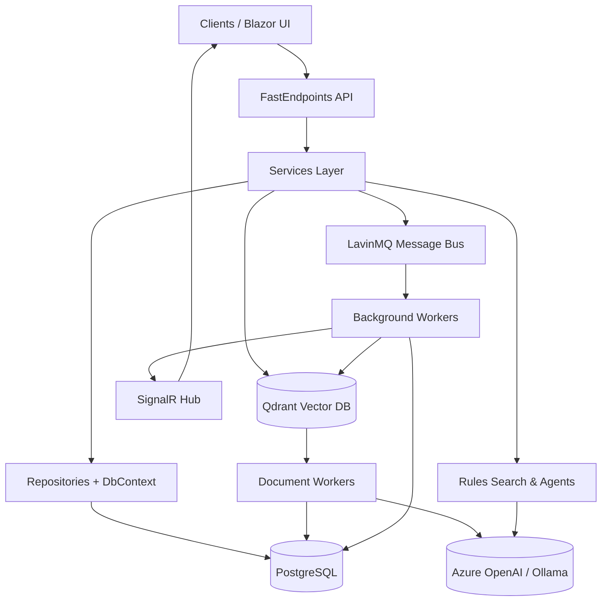
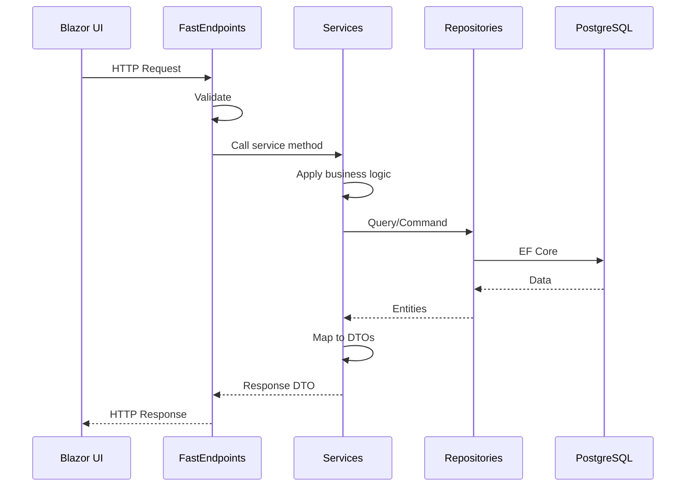
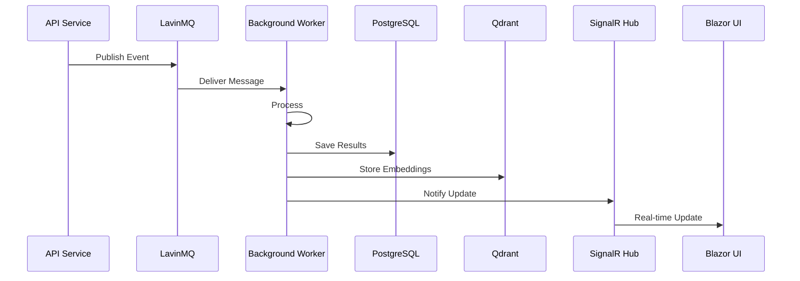
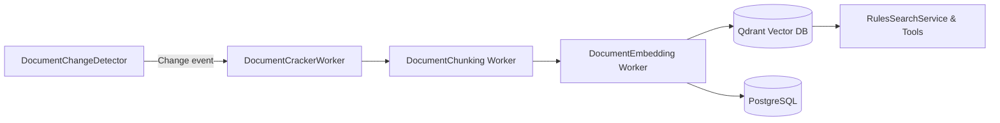

# Architecture Overview

This document provides a high-level view of JAIMES AF's architecture, technology stack, and how the various components interact.

## Stack Overview

JAIMES AF is a **.NET Aspire** solution that coordinates FastEndpoints APIs, Blazor UI, EF Core repositories, document-processing workers, and AI-powered agents to help groups co-create roleplaying adventures with rich observability and testing.

### Technology Stack

- **Presentation:** `JAIMES AF.Web` (Blazor Server) + FastEndpoints APIs in `JAIMES AF.ApiService`
- **Business Logic:** `JAIMES AF.Services` for orchestration, validation, mapping, and AI contracts
- **Persistence:** `JAIMES AF.Repositories` (EF Core, PostgreSQL by default) with migrations
- **Intelligence & Tools:** `JAIMES AF.Agents`, `JAIMES AF.Tools`, plus document-oriented workers
- **Background Pipelines:** `JAIMES AF.Workers` for scanning, cracking, chunking, embedding, and change detection
- **Vector Search:** Qdrant for embeddings and semantic search (rules, conversations)
- **Message Bus:** LavinMQ (RabbitMQ-compatible) for asynchronous event processing
- **Real-Time Updates:** SignalR for pushing background worker results to the UI
- **Hosting & Defaults:** `JAIMES AF.AppHost` for Aspire orchestration and `JAIMES AF.ServiceDefaults` for shared wiring
- **Quality:** `JAIMES AF.Tests` organized by layer (Endpoints, Services, Repositories)

## Layered Architecture

The solution follows a clean layered architecture with clear separation of concerns:

### Key Design Principles

1. **Thin Endpoints**: API endpoints delegate to services that encapsulate business rules, AI prompts, and DTO mapping.
2. **Auto-Registration**: Dependencies are automatically registered matching project conventions.
3. **Async Processing**: Document processing and message analysis happen asynchronously via message bus without blocking the UI.
4. **Real-Time Updates**: SignalR pushes results from background workers to the UI as they complete.
5. **Observability First**: OpenTelemetry instrumentation throughout the stack for tracing, metrics, and logging.

## Project Responsibilities

| Project | Highlights | When to Change |
|---------|-----------|----------------|
| `JAIMES AF.ApiService` | FastEndpoints, DI setup, Serilog, validators | Add/update HTTP surface area, cross-cutting filters |
| `JAIMES AF.Services` | Orchestration, mappers, AI integration | Extend business capabilities, adjust prompts, add DTO fields |
| `JAIMES AF.Repositories` | Entities, DbContext, migrations | Schema changes, seed updates, data access tweaks |
| `JAIMES AF.Web` | Blazor components, interactive dashboards | UI/UX work, dashboards, interactive tooling |
| `JAIMES AF.Workers.*` | Background services coordinated by Aspire | Document ingestion, embeddings, automation |
| `JAIMES AF.Agents` & `JAIMES AF.Tools` | Agent Framework integrations and custom tools | Extend AI behaviors, tool plugins |
| `JAIMES AF.ServiceDefaults` | Shared configuration, telemetry, resilience | Cross-cutting concerns, common infrastructure |
| `JAIMES AF.Tests` | Layered tests | Expand coverage, enforce new behaviors |

## Data Flow Architecture

### Request-Response Flow

### Background Processing Flow

## Mapping & DTO Conventions

- **DTOs** live in `JAIMES AF.Services/Models` and mirror the shape the client expects.
- **Mappers** in `JAIMES AF.Services/Mapping` convert between EF entities and DTOs/response models.
- **API Requests/Responses** in `JAIMES AF.ApiService/Requests` and `/Responses` include validation requirements (via FluentValidation).
- Keep mappers deterministic and unit-testable.

## Background Pipelines

Document processing workers enrich the knowledge base asynchronously:

1. **DocumentChangeDetector** watches configured data sources and emits events.
2. **DocumentCrackerWorker** expands archives/PDFs into discrete assets.
3. **DocumentChunking** normalizes text blocks aligned to the ruleset/game domain.
4. **DocumentEmbedding** vectorizes chunks and pushes them into Qdrant + metadata tables.

## Tips & Conventions

- Keep endpoints lean: validation + mapper + service call; let services enforce business invariants.
- When adjusting seed data or system prompts in `JaimesDbContext`, create a new EF Core migration.
- Background workers share configuration POCOs under their respective configuration folders.
- The architecture provides excellent observability through OpenTelemetry—check the Aspire dashboard for traces, metrics, and logs.
- Services are automatically registered matching conventions—implement the interface and the DI container picks it up.

## Related Documentation

- [Chat Streaming Architecture](CHAT_STREAMING.md) - SSE streaming, real-time chat
- [Agent Framework Integration](AGENT_FRAMEWORK.md) - AI agents, tools, and conversation threads
- [Vector Search & RAG](VECTOR_SEARCH.md) - Qdrant, embeddings, semantic search
- [Message Bus & Workers](MESSAGE_BUS.md) - LavinMQ, background processing, SignalR
- [Database Schema](SCHEMA.md) - Entities, relationships, migrations
