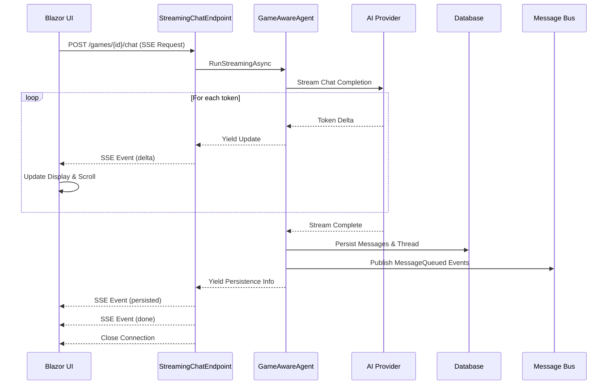

# Chat Streaming Architecture

This document details the chat streaming implementation, from user input through AI response generation to real-time UI updates.

## Overview

The chat system uses **Server-Sent Events (SSE)** for streaming responses from the backend to the Blazor UI. This provides a superior user experience by:

- Showing tokens as they're generated by the LLM.
- Providing immediate visual feedback.
- Automatically scrolling to keep new content visible.

## Complete Flow Diagram

## Protocol Details

The streaming endpoint emits specific **SSE events** that the client must handle:

### 1. `delta`
Contains a chunk of generated text. The UI appends this text to the current message bubble immediately.
- **Payload**: Message ID, Text Delta, Author Name, Role.

### 2. `persisted`
Sent after the agent has successfully saved the conversation to the database. This allows the UI to update temporary local IDs with real database IDs, enabling features like feedback or permalinks.
- **Payload**: User Message ID, Assistant Message ID(s).

### 3. `done`
Indicates the stream has finished cleanly. The UI uses this to re-enable input controls and show completion indicators.

### 4. `error`
Sent if an exception occurs during processing. The UI displays the error message to the user.

## Client-Side Behavior

The Blazor client maintains a state machine for the chat interface:

1. **Sending**: User hits enter. Input is locked, and a temporary "Thinking..." bubble appears.
2. **Streaming**: First `delta` arrives. The "Thinking..." bubble is replaced by the streaming message. Auto-scroll is engaged.
3. **Persisted**: Identifiers are updated in the background.
4. **Complete**: Stream ends. Input is unlocked.

## Performance Characteristics

- **Latency**: First token usually appears within 200-500ms (provider dependent).
- **Throughput**: Updates align 1:1 with LLM token generation.
- **Efficiency**: SSE is lightweight and works over standard HTTP without WebSockets overhead for this unidirectional flow.
- **Persistence**: Database writes happen *after* generation to avoid blocking the visual stream.

## Related Documentation

- [Agent Framework Integration](AGENT_FRAMEWORK.md) - Agent creation, tools, thread management
- [Message Bus & Workers](MESSAGE_BUS.md) - Background processing after message persistence
- [Architecture Overview](ARCHITECTURE.md) - High-level system design
