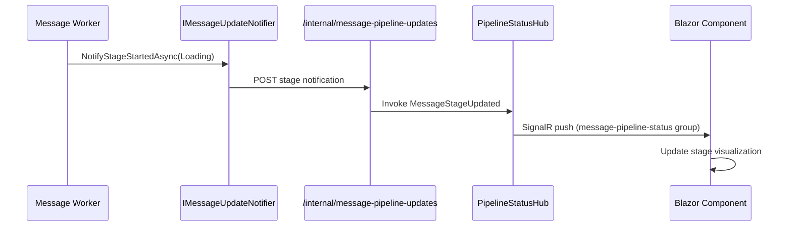

# Message Bus & Background Processing

This document details the LavinMQ message bus architecture, background workers, and real-time SignalR updates.

## Overview

JAIMES AF uses **LavinMQ** (RabbitMQ-compatible) for asynchronous message processing. This decouples intensive tasks from the user-facing API. When chat messages are persisted, events are published to the bus, triggering parallel background workers.

## Architecture


## Key Components

### 1. Message Bus (LavinMQ)
Acts as the central nervous system. It receives events (like `ConversationMessageQueued`) and durably queues them for consumers. This ensures that even if the backend is under heavy load, tasks are not lost.

### 2. Background Workers
These are independent services that listen for specific events.

- **UserMessageWorker (Sentiment)**: Analyzes the user's input to determine emotional tone (Positive/Negative). This helps agents adjust their future responses.
- **AssistantMessageWorker (Evaluation)**: Uses a separate AI model to "grade" the assistant's response on metrics like coherence, relevance, and creativity.
- **ConversationEmbeddingWorker (Memory)**: Generates vector embeddings for new messages and stores them in Qdrant, making them searchable for future context retrieval (RAG).

### 3. Real-Time Updates (SignalR)
Since background tasks take time (seconds to minutes), the UI cannot wait for them. Instead, as soon as a worker finishes its job, it sends a notification via **SignalR**. The UI listens for these events and updates the interface live (e.g., showing a sentiment icon appearing next to a message).

### 4. Stage-Level Pipeline Notifications
Beyond completion notifications, workers report granular stage-level progress via SignalR:



**Stages tracked:**
- **User Pipeline**: Queued → Loading → Sentiment Analysis → Embedding Queue → Complete/Failed
- **Assistant Pipeline**: Queued → Loading → Evaluation → Embedding Queue → Complete/Failed

**Per-Evaluator Progress:**
The Assistant Message pipeline provides fine-grained progress during the Evaluation stage. Each evaluator triggers individual start/complete notifications with the evaluator name and index/total counts, enabling visualization of multi-evaluator runs.

## Parallel Worker Execution

Workers can run with multiple replicas for horizontal scaling. Aspire orchestration supports configurable replicas:

```csharp
// In AppHost.cs
var userReplicas = int.Parse(builder.Configuration["Parameters:user-worker-replicas"] ?? "1");
builder.AddProject<Projects.UserMessageWorker>("user-message-worker")
    .WithReplicas(userReplicas);
```

Each worker instance includes a `WorkerSource` identifier (hostname + process ID) in status updates, allowing the UI to show which instance is processing each message.

## Design Benefits

- **Responsiveness**: The user gets an immediate chat response without waiting for sentiment analysis or embeddings.
- **Scalability**: Workers can be scaled independently of the web server. If analysis is slow, we can add more worker instances.
- **Reliability**: If a worker crashes, the message remains in the queue and will be retried automatically.

## Related Documentation

- [Chat Streaming Architecture](CHAT_STREAMING.md) - Message publishing after streaming
- [Vector Search & RAG](VECTOR_SEARCH.md) - ConversationEmbeddingWorker implementation
- [Architecture Overview](ARCHITECTURE.md) - Background pipeline overview
- [Database Schema](SCHEMA.md) - Message metadata storage
