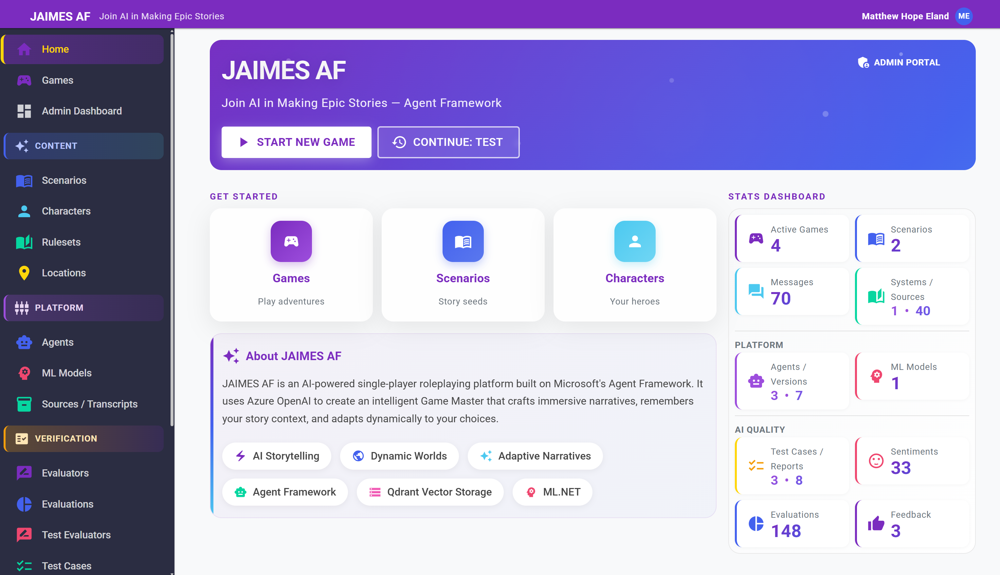
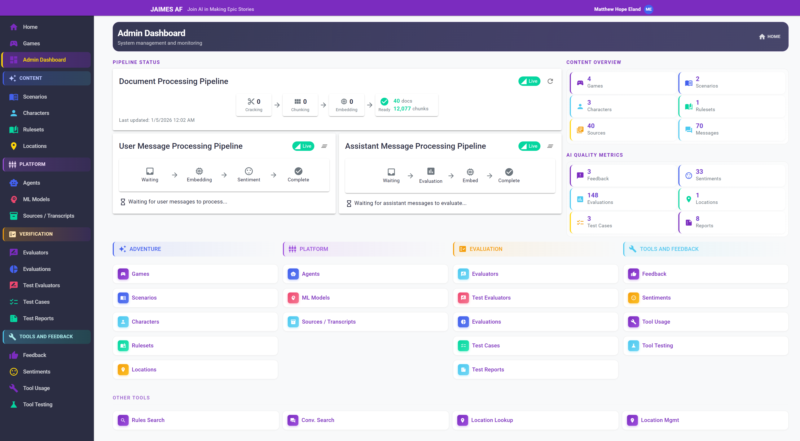
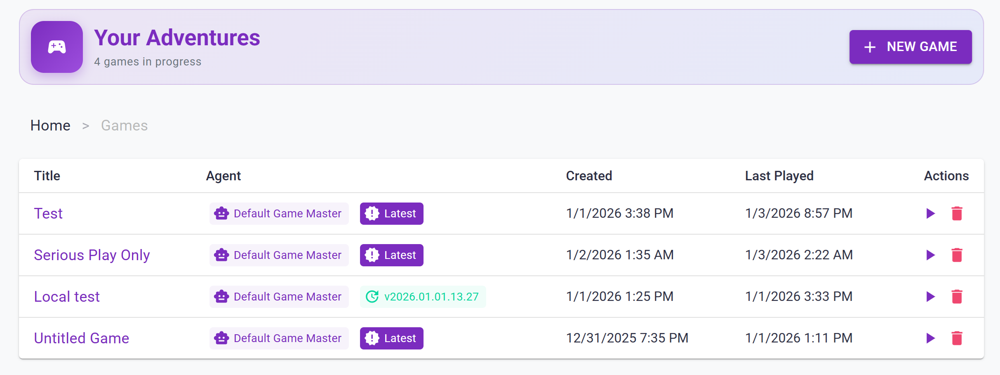

# JAIMES AF Pages Documentation

This document provides a comprehensive inventory of all pages in the JAIMES AF application, organized by major functional section. Each page includes a description, current style guide violations, and improvement suggestions.

> [!NOTE]
> Reference `STYLE_GUIDE.md` for the canonical UI patterns and component usage. `Home.razor` and `Admin.razor` are the gold standard pages.

---

## Primary Navigation

These are the top-level pages accessible directly from the main navigation.

### [Home.razor](JAIMES%20AF.Web/Components/Pages/Home.razor)
**Route:** `/`

**Type:** Hero

Landing page with premium hero section, quick action cards, feature pills, and a comprehensive stats dashboard displaying game, content, platform, and AI quality metrics.

**Style Guide Compliance:** ✅ Excellent — serves as a gold standard reference page

**Improvement Ideas:**
- None — this is a reference page for styling patterns

---

### [Admin.razor](JAIMES%20AF.Web/Components/Pages/Admin.razor)
**Route:** `/admin`

**Type:** Dashboard

System administration dashboard featuring pipeline status panels, content overview stats, AI quality metrics, and organized navigation cards grouped by Adventure, Platform, Evaluation, and Tools/Feedback columns.

**Style Guide Compliance:** ✅ Excellent — serves as a gold standard reference page

**Improvement Ideas:**
- None — this is a reference page for styling patterns

---

### [Games.razor](JAIMES%20AF.Web/Components/Pages/Games.razor)
**Route:** `/games`

**Type:** List

Lists in-progress games with agent version, creation date, and last played timestamp. Features a compact hero section with game count badge. Games using the latest agent version display a "Latest" chip.

**Style Guide Compliance:** ✅ Good - this is a gold standard reference page for lists

---

## Adventure / Content Section

Pages for managing game content including scenarios, characters, rulesets, and locations.

### [Scenarios.razor](JAIMES%20AF.Web/Components/Pages/Scenarios.razor)
**Route:** `/scenarios`

Lists available game scenarios (story seeds) that can be used to start new games.

**Style Guide Violations:**
- Review for proper entity icon usage and tooltip placements

**Improvement Ideas:**
- Add scenario preview or description column
- Consider card-based layout for better visual appeal
- Add scenario category/genre filtering

---

### [Players.razor](JAIMES%20AF.Web/Components/Pages/Players.razor)
**Route:** `/players`

Lists player characters that can be used across different games.

**Style Guide Violations:**
- Review for proper entity icon usage and tooltip placements

**Improvement Ideas:**
- Add character portrait/avatar display
- Include character class/role column
- Add filtering by game or character type

---

### [Rulesets.razor](JAIMES%20AF.Web/Components/Pages/Rulesets.razor)
**Route:** `/rulesets`

Lists game rulesets for managing game mechanics and rules.

**Style Guide Violations:**
- ❌ Uses text "Edit" button instead of icon buttons with tooltips (line 55-58)
- ❌ Missing view details icon button
- ❌ "ID" column shows raw database IDs — could use more user-friendly display

**Improvement Ideas:**
- Replace text "Edit" button with icon button wrapped in tooltip
- Add "View Details" icon button
- Add ruleset description column
- Remove or hide raw ID column
- Consider adding source count or related games column

---

### [Locations.razor](JAIMES%20AF.Web/Components/Pages/Locations.razor)
**Route:** `/admin/locations`

Browse and manage locations filtered by game, with nearby locations and event counts.

**Style Guide Violations:**
- ❌ Tooltip on "View Details" (line 108) missing `Placement.Top`
- ❌ Tooltip on "Edit Location" (line 113) missing `Placement.Top`

**Improvement Ideas:**
- Add `Placement.Top` to all tooltips
- Consider adding a map visualization for location relationships
- Add location type/category filtering

---

### [LocationDetails.razor](JAIMES%20AF.Web/Components/Pages/LocationDetails.razor)
**Route:** `/admin/locations/{id}`

Displays detailed information about a specific location including nearby locations and events.

**Style Guide Violations:**
- Review for tooltip placement consistency

**Improvement Ideas:**
- Add visual map of nearby location connections
- Include quick navigation to nearby locations

---

---

## Platform Section

Pages for managing AI agents, ML models, and RAG collections.

### [Agents.razor](JAIMES%20AF.Web/Components/Pages/Agents.razor)
**Route:** `/agents`

Lists AI agents with their roles and action buttons for viewing, improving prompts, testing, and editing.

**Style Guide Compliance:** ✅ Good — Uses proper tooltip placement and icon conventions

**Improvement Ideas:**
- Add version count column
- Add last activity or creation date
- Consider adding agent status indicators

---

### [AgentDetails.razor](JAIMES%20AF.Web/Components/Pages/AgentDetails.razor)
**Route:** `/agents/{id}`

Detailed view of a specific agent including versions, metrics, and related game data.

**Style Guide Violations:**
- Review for `AgentLink` and `AgentVersionLink` component usage

**Improvement Ideas:**
- Add version history visualization
- Include performance trends chart

---

### [AgentVersionDetails.razor](JAIMES%20AF.Web/Components/Pages/AgentVersionDetails.razor)
**Route:** `/agents/{agentId}/versions/{versionId}`

Detailed view of a specific agent instruction version with its prompt content and metrics.

**Style Guide Violations:**
- Review for proper tooltip placements

**Improvement Ideas:**
- Add diff view comparing to previous version
- Include version-specific metrics charts

---

### [ClassificationModels.razor](JAIMES%20AF.Web/Components/Pages/ClassificationModels.razor)
**Route:** `/admin/classification-models`

Lists ML.NET classification models used for sentiment analysis and other ML tasks.

**Style Guide Violations:**
- Review for tooltip and icon consistency

**Improvement Ideas:**
- Add model accuracy metrics display
- Include training status indicators
- Add model comparison view

---

### [RagCollections.razor](JAIMES%20AF.Web/Components/Pages/RagCollections.razor)
**Route:** `/admin/rag-collections`

Browse and manage RAG (Retrieval Augmented Generation) vector collections for rules and transcripts.

**Style Guide Violations:**
- Review for tooltip placement consistency

**Improvement Ideas:**
- Add vector count visualization
- Include search quality metrics
- Add collection health indicators

---

---

## Verification / Quality Section

Pages for testing, evaluating, and monitoring AI quality.

### [Evaluators.razor](JAIMES%20AF.Web/Components/Pages/Evaluators.razor)
**Route:** `/admin/evaluators`

Lists registered evaluators with their aggregate metrics including pass/fail counts and average scores.

**Style Guide Violations:**
- ❌ Tooltip on "View Metrics" button (line 113) missing `Placement.Top`

**Improvement Ideas:**
- Add `Placement.Top` to all tooltips
- Add evaluator category grouping
- Include trend indicators for pass/fail rates

---

### [EvaluationMetricsList.razor](JAIMES%20AF.Web/Components/Pages/EvaluationMetricsList.razor)
**Route:** `/admin/metrics`

Displays evaluation metrics with filtering by evaluator, agent, and version.

**Style Guide Violations:**
- Review for tooltip and icon consistency

**Improvement Ideas:**
- Add metric trend visualizations
- Include score distribution charts

---

### [EvaluatorTest.razor](JAIMES%20AF.Web/Components/Pages/EvaluatorTest.razor)
**Route:** `/admin/evaluators/test`

Interactive testing interface for running evaluators against sample messages.

**Style Guide Violations:**
- Review for form layout and button patterns

**Improvement Ideas:**
- Add example message templates
- Include evaluator comparison mode

---

### [TestCases.razor](JAIMES%20AF.Web/Components/Pages/TestCases.razor)
**Route:** `/admin/test-cases`

Lists test cases for agent evaluation with run counts, status, and source agent links.

**Style Guide Compliance:** ✅ Good — Uses `AgentLink` component and proper tooltip placements

**Improvement Ideas:**
- Add bulk selection for batch operations
- Include test case grouping/tagging
- Add last run date column

---

### [TestCaseDetails.razor](JAIMES%20AF.Web/Components/Pages/TestCaseDetails.razor)
**Route:** `/admin/test-cases/{id}`

Detailed view of a specific test case including run history and results.

**Style Guide Violations:**
- Review for tooltip consistency

**Improvement Ideas:**
- Add pass/fail trend visualization
- Include comparison with other test cases

---

### [TestReports.razor](JAIMES%20AF.Web/Components/Pages/TestReports.razor)
**Route:** `/admin/test-reports`

Lists test execution reports with agent versions, evaluator counts, and results.

**Style Guide Violations:**
- Review for tooltip placements and icon usage

**Improvement Ideas:**
- Add report comparison shortcuts
- Include summary statistics in header
- Add report status indicators (passed/failed/mixed)

---

### [RunTests.razor](JAIMES%20AF.Web/Components/Pages/RunTests.razor)
**Route:** `/admin/run-tests`

Interface for running test cases against selected agent versions with evaluator configuration.

**Style Guide Violations:**
- Review for form layout consistency

**Improvement Ideas:**
- Add preset test configurations
- Include estimated run time indicator
- Add progress feedback during long runs

---

### [TestRunComparison.razor](JAIMES%20AF.Web/Components/Pages/TestRunComparison.razor)
**Route:** `/admin/test-reports/{id}/compare`

Matrix comparison view of test results across multiple agent versions.

**Style Guide Violations:**
- Review for tooltip placements on metric displays

**Improvement Ideas:**
- Add visual highlighting for best/worst performers
- Include export to CSV/Excel functionality

---

---

## Tools and Feedback Section

Pages for tools, feedback, and sentiment analysis.

### [FeedbackList.razor](JAIMES%20AF.Web/Components/Pages/FeedbackList.razor)
**Route:** `/admin/feedback`

Lists user feedback entries with filtering and navigation to details.

**Style Guide Violations:**
- Review for tooltip and icon consistency

**Improvement Ideas:**
- Add feedback sentiment summary
- Include feedback trend visualization
- Add bulk categorization tools

---

### [FeedbackDetails.razor](JAIMES%20AF.Web/Components/Pages/FeedbackDetails.razor)
**Route:** `/admin/feedback/{id}`

Detailed view of specific feedback including message context and response.

**Style Guide Violations:**
- Review for chat message component usage

**Improvement Ideas:**
- Add quick action buttons for common responses
- Include related feedback suggestions

---

### [SentimentList.razor](JAIMES%20AF.Web/Components/Pages/SentimentList.razor)
**Route:** `/admin/sentiments`

Lists sentiment analysis results across messages.

**Style Guide Violations:**
- Review for SentimentIcon component usage

**Improvement Ideas:**
- Add sentiment trend chart
- Include filtering by sentiment type
- Add time-based filtering

---

### [SentimentDetails.razor](JAIMES%20AF.Web/Components/Pages/SentimentDetails.razor)
**Route:** `/admin/sentiments/{id}`

Detailed view of a specific sentiment analysis including message context.

**Style Guide Violations:**
- Review for chat message component usage

**Improvement Ideas:**
- Add comparison with similar messages
- Include ML confidence score display

---

### [ToolUsage.razor](JAIMES%20AF.Web/Components/Pages/ToolUsage.razor)
**Route:** `/admin/tools`

Displays tool call statistics and usage metrics across agents.

**Style Guide Compliance:** ✅ Good — Clean layout with proper breadcrumbs

**Improvement Ideas:**
- Add tool usage trend visualizations
- Include success/failure rate metrics
- Add tool performance comparisons

---

### [ToolDetails.razor](JAIMES%20AF.Web/Components/Pages/ToolDetails.razor)
**Route:** `/admin/tools/{toolName}`

Detailed view of a specific tool including call history and parameters.

**Style Guide Violations:**
- Review for tooltip placements

**Improvement Ideas:**
- Add parameter distribution visualization
- Include execution time histogram

---

### [ToolTestPage.razor](JAIMES%20AF.Web/Components/Pages/ToolTestPage.razor)
**Route:** `/admin/tool-test`

Interactive testing interface for agent tools.

**Style Guide Violations:**
- Review for form and button consistency

**Improvement Ideas:**
- Add preset test scenarios
- Include tool comparison mode

---

---

## Other Tools (Footer Section)

Testing and search utilities accessible from the Admin dashboard footer.

### [RulesSearchTest.razor](JAIMES%20AF.Web/Components/Pages/RulesSearchTest.razor)
**Route:** `/tools/rules-search`

Interactive search interface for testing ruleset/sourcebook RAG searches.

**Style Guide Violations:**
- Review for form and result display consistency

**Improvement Ideas:**
- Add search history
- Include relevance score visualization

---

### [ConversationSearchTest.razor](JAIMES%20AF.Web/Components/Pages/ConversationSearchTest.razor)
**Route:** `/tools/conversation-search`

Interactive search interface for testing conversation/transcript RAG searches.

**Style Guide Violations:**
- Review for form and result display consistency

**Improvement Ideas:**
- Add context window visualization
- Include conversation threading display

---

### [LocationLookupTest.razor](JAIMES%20AF.Web/Components/Pages/LocationLookupTest.razor)
**Route:** `/tools/location-lookup`

Testing interface for location lookup tool functionality.

**Style Guide Violations:**
- Review for form consistency

**Improvement Ideas:**
- Add location map visualization
- Include nearby location previews

---

### [LocationManagementTest.razor](JAIMES%20AF.Web/Components/Pages/LocationManagementTest.razor)
**Route:** `/tools/location-management`

Testing interface for location management tool functionality.

**Style Guide Violations:**
- Review for form consistency

**Improvement Ideas:**
- Add location relationship builder
- Include validation preview

---

---

## Game Flow Pages

Pages involved in the game playing experience.

### [GameDetails.razor](JAIMES%20AF.Web/Components/Pages/GameDetails.razor)
**Route:** `/games/{id}`

Main game playing interface with chat conversation, message input, and game state management.

**Style Guide Violations:**
- Review for `PlayerMessage`, `AssistantMessage`, and `ErrorMessage` component usage
- Review for `MessageIndicators` and `SentimentIcon` usage in chat footers

**Improvement Ideas:**
- Add typing indicator during AI response
- Include character portrait display
- Add quick action buttons for common player actions

---

### [NewGame.razor](JAIMES%20AF.Web/Components/Pages/NewGame.razor)
**Route:** `/games/new`

Interface for creating a new game with scenario, character, and agent selection.

**Style Guide Violations:**
- Review for form layout and select component styling

**Improvement Ideas:**
- Add scenario preview cards
- Include character/agent recommendations
- Add "Quick Start" with random selections

---

### [TranscriptMessageDetails.razor](JAIMES%20AF.Web/Components/Pages/TranscriptMessageDetails.razor)
**Route:** `/games/{gameId}/messages/{messageId}`

Detailed view of a specific message including evaluations and tool calls.

**Style Guide Violations:**
- Review for chat message component usage

**Improvement Ideas:**
- Add context window showing surrounding messages
- Include evaluation breakdown visualization

---

---

## Entity Edit Pages

Form pages for creating and editing entities.

### [EditAgent.razor](JAIMES%20AF.Web/Components/Pages/EditAgent.razor)
**Route:** `/agents/{id}/edit`

Form for editing agent instructions (creates new version).

**Style Guide Compliance:** ✅ Good — Follows form page structure pattern

**Improvement Ideas:**
- Add prompt template suggestions
- Include version comparison preview

---

### [NewAgent.razor](JAIMES%20AF.Web/Components/Pages/NewAgent.razor)
**Route:** `/agents/new`

Form for creating a new agent.

**Style Guide Violations:**
- Review for form layout consistency

**Improvement Ideas:**
- Add agent type templates
- Include sample instruction prompts

---

### [EditScenario.razor](JAIMES%20AF.Web/Components/Pages/EditScenario.razor)
**Route:** `/scenarios/{id}/edit`

Form for editing scenario details.

**Style Guide Violations:**
- Review for form layout consistency

**Improvement Ideas:**
- Add preview mode
- Include AI-assisted scenario refinement

---

### [NewScenario.razor](JAIMES%20AF.Web/Components/Pages/NewScenario.razor)
**Route:** `/scenarios/new`

Form for creating a new scenario.

**Style Guide Violations:**
- Review for form layout consistency

**Improvement Ideas:**
- Add scenario templates by genre
- Include AI scenario generator

---

### [EditPlayer.razor](JAIMES%20AF.Web/Components/Pages/EditPlayer.razor)
**Route:** `/players/{id}/edit`

Form for editing character details.

**Style Guide Violations:**
- Review for form layout consistency

**Improvement Ideas:**
- Add character portrait upload
- Include attribute builder

---

### [NewPlayer.razor](JAIMES%20AF.Web/Components/Pages/NewPlayer.razor)
**Route:** `/players/new`

Form for creating a new character.

**Style Guide Violations:**
- Review for form layout consistency

**Improvement Ideas:**
- Add character templates
- Include AI character generator

---

### [EditRuleset.razor](JAIMES%20AF.Web/Components/Pages/EditRuleset.razor)
**Route:** `/rulesets/{id}/edit`

Form for editing ruleset details.

**Style Guide Violations:**
- Review for form layout consistency

**Improvement Ideas:**
- Add rule section templates
- Include sourcebook linking

---

### [NewRuleset.razor](JAIMES%20AF.Web/Components/Pages/NewRuleset.razor)
**Route:** `/rulesets/new`

Form for creating a new ruleset.

**Style Guide Violations:**
- Review for form layout consistency

**Improvement Ideas:**
- Add popular system templates
- Include AI ruleset builder

---

### [EditLocation.razor](JAIMES%20AF.Web/Components/Pages/EditLocation.razor)
**Route:** `/admin/locations/{id}/edit`

Form for editing location details including nearby location relationships.

**Style Guide Violations:**
- Review for form layout consistency

**Improvement Ideas:**
- Add map-based nearby location selector
- Include auto-generated descriptions

---

---

## Utility Pages

System and utility pages.

### [Error.razor](JAIMES%20AF.Web/Components/Pages/Error.razor)
**Route:** `/error`

Error display page shown when unhandled exceptions occur.

**Style Guide Violations:**
- Review for proper error styling

**Improvement Ideas:**
- Add error categorization
- Include recovery suggestions
- Add "Report Issue" functionality

---

### [PromptImproverWizard.razor](JAIMES%20AF.Web/Components/Pages/PromptImproverWizard.razor)
**Route:** `/agents/{id}/improve`

Multi-step wizard for AI-assisted prompt improvement.

**Style Guide Violations:**
- Review for wizard step consistency

**Improvement Ideas:**
- Add before/after comparison
- Include rollback functionality
- Add improvement suggestion explanations

---

### [TrainClassifier.razor](JAIMES%20AF.Web/Components/Pages/TrainClassifier.razor)
**Route:** `/admin/classification-models/{id}/train`

Interface for training ML classification models.

**Style Guide Violations:**
- Review for form and progress display consistency

**Improvement Ideas:**
- Add training progress visualization
- Include model validation metrics

---

---

## Dialog Components

Modal dialogs used across the application.

### [DiagnosticsDialog.razor](JAIMES%20AF.Web/Components/Pages/DiagnosticsDialog.razor)
Displays diagnostic information for debugging.

### [EvaluationMetricsDialog.razor](JAIMES%20AF.Web/Components/Pages/EvaluationMetricsDialog.razor)
Shows detailed evaluation metrics in a modal.

### [FeedbackDialog.razor](JAIMES%20AF.Web/Components/Pages/FeedbackDialog.razor)
Form dialog for submitting feedback.

### [NewLocationDialog.razor](JAIMES%20AF.Web/Components/Pages/NewLocationDialog.razor)
Form dialog for creating new locations.

---

## Summary of Common Style Guide Violations

| Issue | Severity | Affected Pages |
|-------|----------|----------------|
| Missing `Placement.Top` on tooltips | High | Games, Locations, Evaluators |
| Icon buttons without tooltip wrappers | High | Games |
| Text buttons instead of icon buttons | Medium | Rulesets |
| Raw database IDs displayed | Low | Rulesets |

## Priority Improvements

1. **High Priority:** Add `Placement.Top` to all tooltips application-wide
2. **High Priority:** Wrap all icon buttons in `MudTooltip`
3. **Medium Priority:** Replace text action buttons with icon buttons in tables
4. **Low Priority:** Add visualization components to metric pages
