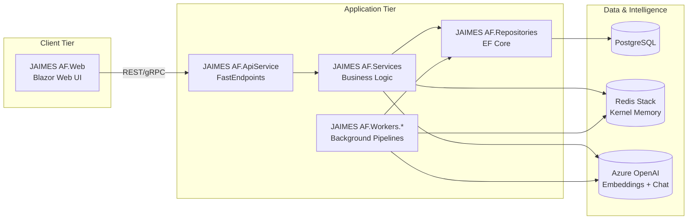
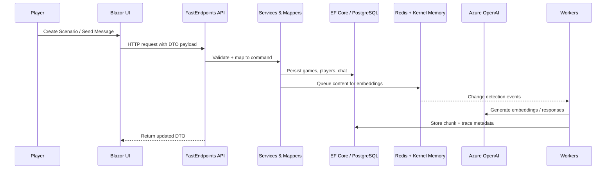

# JAIMES AF

**Join AI in Making Epic Stories — Agent Framework Edition**

JAIMES AF is a .NET Aspire solution that coordinates FastEndpoints APIs, Blazor UI, EF Core repositories, document-processing workers, and Azure OpenAI-powered assistants to help groups co-create roleplaying adventures with rich observability and testing.

## Getting Started

> [!TIP]
> **New to the project?**
> Check out **[GETTING_STARTED.md](GETTING_STARTED.md)** for setup instructions, prerequisites, and rapid start commands.

## Documentation Index

- **[GETTING_STARTED.md](GETTING_STARTED.md)** - Setup, configuration, and development guidelines.
- **[ARCHITECTURE.md](ARCHITECTURE.md)** - High-level system architecture, design patterns, and data flow.
- **[AGENT_FRAMEWORK.md](AGENT_FRAMEWORK.md)** - Concepts behind the AI agent integration, tools, and conversation threads.
- **[CHAT_STREAMING.md](CHAT_STREAMING.md)** - Architecture of the real-time chat streaming system (Server-Sent Events).
- **[MESSAGE_BUS.md](MESSAGE_BUS.md)** - Overview of the message bus and background worker roles.
- **[VECTOR_SEARCH.md](VECTOR_SEARCH.md)** - Explanation of the RAG pipeline and vector search implementation.
- **[SCHEMA.md](SCHEMA.md)** - Database schema and entity relationships.
- **[TECHNICAL_DETAILS.md](TECHNICAL_DETAILS.md)** - Comprehensive index of technical topics.

## Solution Topology

The Aspire AppHost wires together the API, background workers, and dependencies (PostgreSQL, Redis Stack, Azure OpenAI).

### Gameplay & Document Flow

## Core Capabilities

- **FastEndpoints-backed API** surface for game, player, scenario, and ruleset management.
- **Modular Service Layer** with clear interfaces and business logic encapsulation.
- **EF Core Repositories** supporting PostgreSQL with robust migrations.
- **Document Processing Pipeline** that cracks, chunks, and embeds documents for RAG.
- **Azure OpenAI Integration** for intelligent, context-aware responses.
- **Observability** baked in via OpenTelemetry and Aspire dashboards.

For deep dives into these capabilities, please refer to the files listed in the **Documentation Index**.

