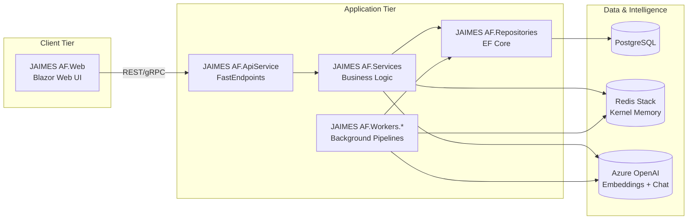
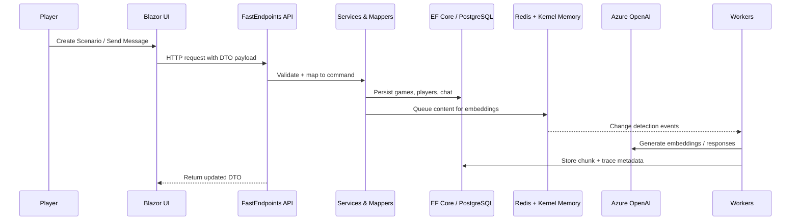

# JAIMES AF
**Join AI in Making Epic Stories — Agent Framework Edition**

JAIMES AF is a .NET 10 Aspire solution that coordinates FastEndpoints APIs, Blazor UI, EF Core repositories, document-processing workers, and Azure OpenAI-powered assistants to help groups co-create roleplaying adventures with rich observability and testing.

The documentation below highlights the core moving pieces, how information flows through the system, and how to get productive quickly. Refer to `TECHNICAL_OVERVIEW.md` for deeper architectural notes.

## Solution Topology

The Aspire AppHost wires together the API, background workers, and dependencies (PostgreSQL, Redis Stack, Azure OpenAI). The diagram below shows the high-level structure.



### Gameplay & Document Flow



## Core Capabilities

- FastEndpoints-backed API surface for game, player, scenario, and ruleset management
- Modular service layer with Scrutor-powered discovery and Shouldly-tested behavior
- EF Core repositories with PostgreSQL default and SQL Server / Azure SQL option
- Document processing pipeline (scanner → cracking → chunking → embedding) backed by Aspire workers and Redis Kernel Memory
- Azure OpenAI integration for chat service prompts and vector embeddings
- Observability, resilience, and configuration defaults consolidated through `JAIMES AF.ServiceDefaults`

## Project Map

- `JAIMES AF.ApiService` — HTTP endpoints, request/response models, DI root
- `JAIMES AF.Web` — Blazor front-end with interactive components
- `JAIMES AF.Services` — Business logic, DTO mappers, Scrutor registrations
- `JAIMES AF.Repositories` — Entities, DbContext, and migrations
- `JAIMES AF.Agents` / `JAIMES AF.Tools` — Agent Framework integrations and custom tools
- `JAIMES AF.Workers.*` — Aspire background processes for document change detection, cracking, chunking, embedding, and scanning
- `JAIMES AF.AppHost` — Orchestrates services, Redis Stack, and health dashboards
- `JAIMES AF.Tests` — Endpoint, service, and repository tests using Shouldly assertions

## Prerequisites

- .NET 10 SDK
- Docker Desktop or another container runtime (required by Aspire to provision PostgreSQL, Redis Stack, MongoDB, and other services)
- Azure OpenAI resource for chat + embeddings

## Quickstart

1. **Configure secrets (Azure OpenAI)**
   ```bash
   cd "JAIMES AF.ApiService"
   dotnet user-secrets set "ChatService:Endpoint" "https://YourResource.openai.azure.com/"
   dotnet user-secrets set "ChatService:ApiKey" "your-real-api-key"
   ```

2. **Run the Aspire host**
   ```bash
   dotnet run --project "JAIMES AF.AppHost"
   ```

3. **Open the Aspire dashboard** to inspect health, logs, and Redis Stack observability.

## Database Configuration

- **PostgreSQL (default):** The Aspire AppHost automatically provisions a PostgreSQL database with pgvector support. The connection string is provided by Aspire via the `jaimes-db` connection name. Migrations are applied automatically on startup with seed data (D&D 5e ruleset, default player, and island test scenario).
- **Local Development:** For local development without Aspire, a fallback connection string is provided in `appsettings.Development.json` pointing to `localhost:5432`.
- **Production:** In production, the connection string should be provided via environment variables or a secure configuration provider (Azure App Configuration, Key Vault, etc.).

## Redis & Kernel Memory

- Aspire automatically provisions Redis Stack for vector storage when you launch `JAIMES AF.AppHost`.
- Data persists under `%LocalAppData%/Aspire/jaimes-redis-data` (Windows) or the equivalent container volume on Linux/macOS.
- RedisInsight is exposed at `http://localhost:8001` for local inspection.
- Troubleshooting tips:
  - Ensure Docker Desktop is running (`docker ps` should succeed).
  - Restart Docker if Aspire reports the runtime as unhealthy.
  - Free port `6379` if another Redis instance is already bound.

Advanced override (rarely needed):

```json
{
  "VectorDb": {
    "ConnectionString": "localhost:6379"
  }
}
```

## Chat Service Configuration

- Default deployment name: `gpt-4o-mini` (update `ChatService:Deployment` to match your Azure OpenAI resource).
- Secrets required:
  ```bash
  cd "JAIMES AF.ApiService"
  dotnet user-secrets set "ChatService:Endpoint" "https://YourResource.openai.azure.com/"
  dotnet user-secrets set "ChatService:ApiKey" "your-actual-api-key"
  ```
- Add optional settings such as temperature or system prompts via `appsettings.*.json` or user secrets.

## Running Tests

```bash
# Build everything
dotnet build

# Full suite (Microsoft Test Platform)
dotnet run --project "JAIMES AF.Tests/JAIMES AF.Tests.csproj"

# Targeted suites
dotnet run --project "JAIMES AF.Tests/JAIMES AF.Tests.csproj" -- --filter "FullyQualifiedName~Endpoints"
dotnet run --project "JAIMES AF.Tests/JAIMES AF.Tests.csproj" -- --filter "FullyQualifiedName~Services"
dotnet run --project "JAIMES AF.Tests/JAIMES AF.Tests.csproj" -- --filter "FullyQualifiedName~Repositories"
```

Guidelines:
- Always use Shouldly assertions.
- Keep tests aligned with service contracts when adding properties/behavior.
- Use the in-memory DbContext helpers for repository specs.

## Development Notes

- Services, mappers, and validators are registered automatically via Scrutor conventions—implement the interface, and the DI container will pick it up.
- Prefer small, composable endpoints that delegate logic to services.
- Update documentation and tests when modifying DTOs, migrations, or background flows.
- See `TECHNICAL_OVERVIEW.md` for detailed layer responsibilities and data schemas (including Mermaid diagrams).

### Code Analysis

- Solution-wide analyzers (Roslyn, StyleCop, Meziantou) execute via `dotnet format style` and `dotnet format analyzers`. Run them locally to match CI.
- Code coverage is collected via Coverlet during `dotnet test`, and the resulting OpenCover report (`TestResults/coverage/coverage.opencover.xml`) is published to SonarCloud for quality gates.
