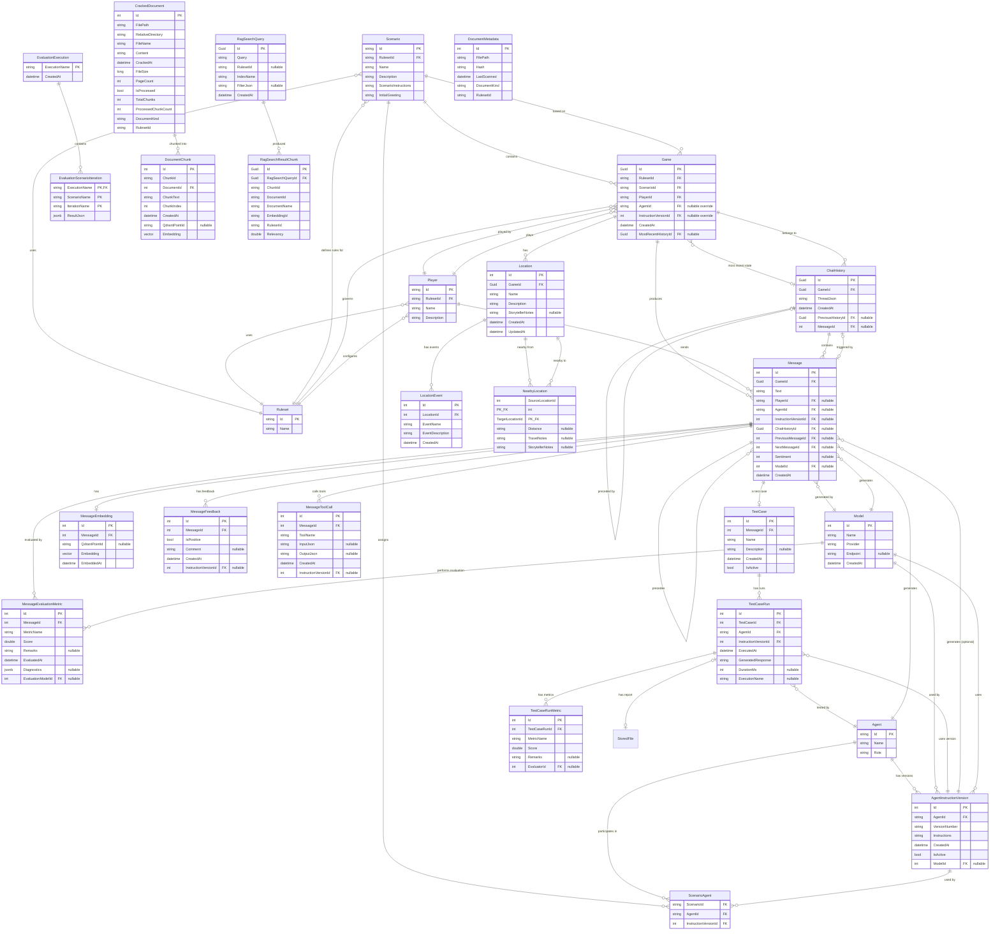

# JAIMES Database Schema

This document describes the database schema for the JAIMES (Just Another Interactive Multiplayer Entertainment System) application.

## Entity Relationship Diagram

## Core Entities

### Agent
Represents an AI agent that can participate in games. Each agent has multiple instruction versions that define its behavior.

### AgentInstructionVersion
Immutable versions of agent instructions. When agent instructions are modified, a new version is created rather than updating existing ones. Includes a reference to the `Model` configured for this version.

### Scenario
A game scenario that defines the setting, plot, and rules for a game session.

### ScenarioAgent
Links scenarios to agents with specific instruction versions. This allows different scenarios to use the same agent with different instruction versions.

### Game
An instance of a scenario being played by a player. Tracks the current state via `MostRecentHistoryId`. Can optionally override the agent and instruction version specified by the scenario (defined via ScenarioAgent mapping).

### Player
A human player who can participate in games. Associated with a specific `Ruleset`.

### Ruleset
A set of rules that govern gameplay (e.g., D&D 5e, custom rules).

### Message
Individual messages in a conversation. Messages are linked in a chain (`PreviousMessageId`, `NextMessageId`) and can be attributed to a `Player`, an `Agent`, or the System. They also track the `Model` that generated them and an optional `Sentiment` score.

### ChatHistory
Snapshots of conversation state, stored as JSON in `ThreadJson`. Used for branching or resuming games at specific points.

## AI & Model Entities

### Model
Represents an AI model (e.g., GPT-4, Gemma) from a specific provider (e.g., OpenAI, Ollama). Used to track which models are used for generation and evaluation.

### MessageEmbedding
Stores the vector embedding for a message, used for semantic search. Vectors are stored in PostgreSQL using `pgvector`.

### MessageToolCall
Records tool/function calls made by a model during the generation of a message, including input parameters and output results.

### MessageFeedback
User-provided feedback (thumbs up/down) on specific messages, used for evaluating model performance.

## Evaluation Entities

### MessageEvaluationMetric
Stores automated evaluation scores (e.g., Relevance, Truthfulness) for a message, typically generated by another AI model (`EvaluationModelId`).

### EvaluationExecution
A named run of an evaluation suite, grouping multiple scenario iterations.

### EvaluationScenarioIteration
The results of a specific scenario run within an evaluation execution, stored as JSON.

## Test Case Entities

### TestCase
References a player message as a test case for agent evaluation. When running tests, the agent receives the last 5 messages prior to this message plus the agent's prompt as the system prompt.

### TestCaseRun
Stores the results of running a specific test case against an agent version. Captures the generated response and execution metadata.

### TestCaseRunMetric
Stores evaluation metrics from test case runs, similar to `MessageEvaluationMetric` but for test runs that are not persisted to the Messages table.

## RAG & Document Storage

### DocumentMetadata
Tracks source files and their hashes to detect changes and manage rescanning.

### CrackedDocument
Stores the full text content and metadata of a "cracked" (parsed) source document.

### DocumentChunk
Small, overlapping segments of text from a `CrackedDocument`, each with its own vector embedding for RAG retrieval.

### RagSearchQuery
Diagnostic record of a RAG search performed, including the query text and filters.

### RagSearchResultChunk
Records which `DocumentChunk`s were retrieved for a specific `RagSearchQuery` and their relevancy scores.

## Location Tracking

### Location
A named location within a game world, scoped to a single game. Locations help the AI storyteller maintain consistent world-building. Names are unique within each game.

### LocationEvent
Significant events that have occurred at a location. Used by the AI to reference past happenings and maintain narrative consistency.

### NearbyLocation
Links two locations as being near each other, with optional distance and travel information. Includes `StorytellerNotes` for the AI to hide secrets from players.

## Business Rules

1. **Agent Instructions are Immutable**: Once created, `AgentInstructionVersion` records cannot be modified. Changes to agent behavior require creating new versions.

2. **Active Instruction Versions**: Each agent should have exactly one active instruction version at any time, though multiple versions can exist for historical reference.

3. **Scenario-Agent Relationships**: Scenarios can have multiple agents assigned, each with a specific instruction version.

4. **Message Attribution**: Messages can be attributed to either players or agents, but not both. Agent-generated messages include a reference to the specific instruction version and model used.

5. **Vector Storage**: Embeddings are stored in both Qdrant (for fast retrieval) and PostgreSQL (for persistence and relational queries).
6. **Agent Overrides**: Games can optionally override the default agent and instruction version specified by the scenario. If these are set at the game level, subsequent AI messages will use the overridden agent and instructions.

## Migration Notes

- **Primary Keys**: Many entities moved from GUIDs to auto-incrementing integers for performance and readability, though `Game`, `ChatHistory`, and RAG diagnostic entities still use GUIDs.
- **RAG System**: Added comprehensive document parsing, chunking, and search diagnostic entities.
- **Evaluation System**: Added entities to track model performance and evaluation metrics.
- **Model Tracking**: Introduced the `Model` entity to centralize model configuration and attribution.
