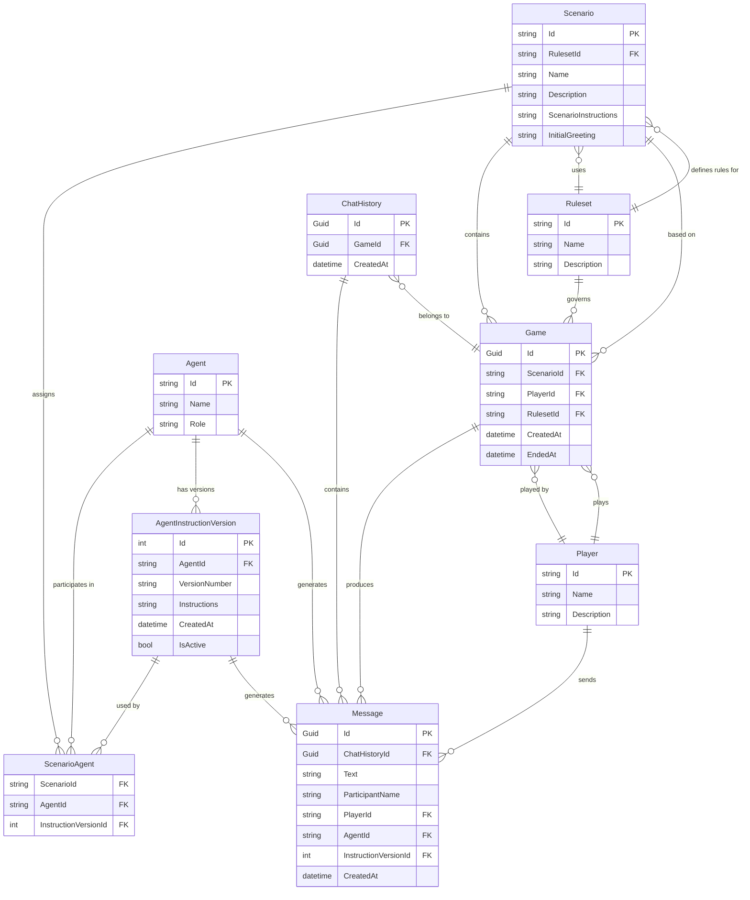

# JAIMES Database Schema

This document describes the database schema for the JAIMES (Just Another Interactive Multiplayer Entertainment System) application.

## Entity Relationship Diagram

## Core Entities

### Agent
Represents an AI agent that can participate in games. Each agent has multiple instruction versions that define its behavior.

**Key Fields:**
- `Id`: Unique identifier (string)
- `Name`: Display name
- `Role`: The agent's role/purpose (e.g., "GameMaster", "NPC", "Narrator")

### AgentInstructionVersion
Immutable versions of agent instructions. When agent instructions are modified, a new version is created rather than updating existing ones.

**Key Fields:**
- `Id`: Auto-incrementing primary key (int)
- `AgentId`: Reference to the agent
- `VersionNumber`: Human-readable version (e.g., "v1.0", "2024.01.15")
- `Instructions`: The complete instruction set for the agent
- `CreatedAt`: When this version was created
- `IsActive`: Whether this is the currently active version for the agent

### Scenario
A game scenario that defines the setting, plot, and rules for a game session.

**Key Fields:**
- `Id`: Unique identifier (string)
- `RulesetId`: Reference to the ruleset used
- `Name`: Display name
- `Description`: Optional description
- `ScenarioInstructions`: Context-specific instructions for GMs and agents
- `InitialGreeting`: The opening message shown to players

### ScenarioAgent
Links scenarios to agents with specific instruction versions. This allows different scenarios to use the same agent with different instruction versions.

**Key Fields:**
- `ScenarioId`: Reference to the scenario
- `AgentId`: Reference to the agent
- `InstructionVersionId`: Which version of the agent's instructions to use

### Game
An instance of a scenario being played by a player.

**Key Fields:**
- `Id`: Unique identifier (GUID)
- `ScenarioId`: Which scenario is being played
- `PlayerId`: Who is playing
- `RulesetId`: Which ruleset governs the game
- `CreatedAt`: When the game started
- `EndedAt`: When the game ended (nullable)

### Player
A human player who can participate in games.

**Key Fields:**
- `Id`: Unique identifier (string)
- `Name`: Display name
- `Description`: Optional character description

### Ruleset
A set of rules that govern gameplay (e.g., D&D 5e, custom rules).

**Key Fields:**
- `Id`: Unique identifier (string)
- `Name`: Display name
- `Description`: Optional description

### Message
Individual messages in a conversation, either from players or AI agents.

**Key Fields:**
- `Id`: Unique identifier (GUID)
- `ChatHistoryId`: Which conversation this belongs to
- `Text`: The message content
- `ParticipantName`: Who sent the message
- `PlayerId`: If sent by a player (nullable)
- `AgentId`: If sent by an agent (nullable)
- `InstructionVersionId`: Which agent instruction version generated this message (nullable)
- `CreatedAt`: When the message was sent

### ChatHistory
A conversation thread within a game.

**Key Fields:**
- `Id`: Unique identifier (GUID)
- `GameId`: Which game this conversation belongs to
- `CreatedAt`: When the conversation started

## Business Rules

1. **Agent Instructions are Immutable**: Once created, `AgentInstructionVersion` records cannot be modified. Changes to agent behavior require creating new versions.

2. **Active Instruction Versions**: Each agent should have exactly one active instruction version at any time, though multiple versions can exist for historical reference.

3. **Scenario-Agent Relationships**: Scenarios can have multiple agents assigned, each with a specific instruction version. This allows the same agent to behave differently in different scenarios.

4. **Message Attribution**: Messages can be attributed to either players or agents, but not both. Agent-generated messages include a reference to the specific instruction version used.

5. **Scenario Isolation**: Each game is based on exactly one scenario and uses the agents assigned to that scenario at game creation time.

## Migration Notes

- Agent instruction versions were introduced to make agent behavior more version-controlled and auditable
- The `ScenarioAgent` junction table enables many-to-many relationships between scenarios and agents
- The `SystemPrompt` field was removed from `Scenario` and replaced with scenario-specific `ScenarioInstructions` that are separate from agent instructions