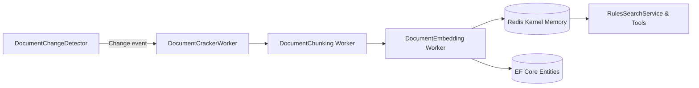
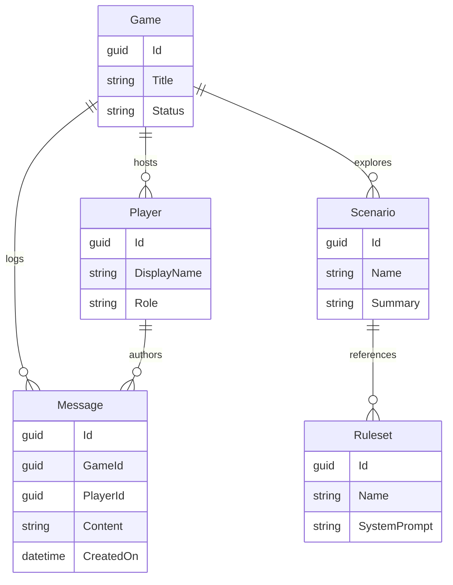

Project Technical Overview
==========================

This solution targets **.NET 10** and is organized as an Aspire-composed, multi-project architecture. The intent is to
keep the boundaries between API, services, repositories, UI, workers, and tooling crisp so features and experiments can
evolve independently.

Use this guide to understand the big rocks, discover where specific responsibilities live, and see how data moves
through the system.

## Stack Snapshot

- **Presentation:** `JAIMES AF.Web` (Blazor Server) + FastEndpoints APIs in `JAIMES AF.ApiService`
- **Business Logic:** `JAIMES AF.Services` for orchestration, validation, mapping, and AI contracts
- **Persistence:** `JAIMES AF.Repositories` (EF Core, PostgreSQL by default) with migrations under `Migrations/`
- **Intelligence & Tools:** `JAIMES AF.Agents`, `JAIMES AF.Tools`, plus document-oriented workers
- **Background Pipelines:** `JAIMES AF.Workers.*` for scanning, cracking, chunking, embedding, and change detection
- **Hosting & Defaults:** `JAIMES AF.AppHost` for Aspire orchestration and `JAIMES AF.ServiceDefaults` for shared wiring
- **Quality:** `JAIMES AF.Tests` organized by layer (Endpoints, Services, Repositories) with Shouldly assertions

## Layered Architecture

```mermaid
graph TD
    A[Clients / Blazor UI] --> B[FastEndpoints API\n(JAIMES AF.ApiService)]
    B --> C[Services Layer\n(JAIMES AF.Services)]
    C --> D[Repositories + DbContext\n(JAIMES AF.Repositories)]
    C --> E[Rules Search & Agents\n(JAIMES AF.Agents / Tools)]
    D --> F[(PostgreSQL / SQL Server)]
    C --> G[(Redis Stack / Kernel Memory)]
    G --> H[Document Workers\n(scanner, cracker, chunker, embedder)]
    H --> F
    H --> I[(Azure OpenAI)]
    E --> I
```

**Key takeaways**

- Endpoints are intentionally thin; they delegate to services that encapsulate business rules, AI prompts, and mapping
  to DTOs.
- Services communicate with repositories via strongly typed DTOs/entities. Scrutor automatically registers anything
  matching the project's conventions.
- Document-processing workers enrich the knowledge base asynchronously and feed Kernel Memory (Redis) plus Azure OpenAI
  embeddings.

## Background Pipelines



1. **DocumentChangeDetector** watches configured data sources and emits events.
2. **DocumentCrackerWorker** expands archives/PDFs into discrete assets.
3. **DocumentChunking** normalizes text blocks aligned to the ruleset/game domain.
4. **DocumentEmbedding** calls Azure OpenAI to vectorize chunks and pushes them into Redis Stack + metadata tables,
   unlocking semantic search via `RulesSearchService`.

## Domain Schema (simplified)



### Mapping & DTO Conventions

- DTOs live in `JAIMES AF.Services/Models` and should mirror the shape the client expects.
- Mappers in `JAIMES AF.Services/Mapping` convert between EF entities and DTOs/response models. Keep them deterministic
  and unit-testable.
- API Requests/Responses live inside `JAIMES AF.ApiService/Requests` and `/Responses`. They often mirror DTOs but can
  include input validation requirements (via FluentValidation) or mask internal fields.

## Project Responsibilities

| Project                                | Highlights                                                                | When to change                                               |
|----------------------------------------|---------------------------------------------------------------------------|--------------------------------------------------------------|
| `JAIMES AF.ApiService`                 | FastEndpoints, DI setup, Serilog, FastEndpoints validators                | Add/update HTTP surface area, cross-cutting filters          |
| `JAIMES AF.Services`                   | Orchestration, mappers, Azure OpenAI chat and rules search integration    | Extend business capabilities, adjust prompts, add DTO fields |
| `JAIMES AF.Repositories`               | Entities, DbContext, migrations, repository registration                  | Schema changes, seed updates, data access tweaks             |
| `JAIMES AF.Web`                        | Blazor components, interactive dashboards, real-time updates              | UI/UX work, dashboards, interactive tooling                  |
| `JAIMES AF.Workers.*`                  | Background services coordinated by Aspire                                 | Document ingestion, embeddings, automation                   |
| `JAIMES AF.Agents` & `JAIMES AF.Tools` | Microsoft Agent Framework agents + custom tools that leverage RulesSearch | Extend AI behaviors, tool plugins                            |
| `JAIMES AF.Tests`                      | Layered tests using Shouldly + in-memory providers                        | Expand coverage, enforce new behaviors                       |

## Development Workflow

1. **Plan the change** — identify DTO/entity impacts and decide which layers need updates.
2. **Implement** in the appropriate project. Remember that constructor injections ripple into tests.
3. **Update documentation** (README/TECHNICAL_OVERVIEW) when behavior or flows shift.
4. **Run checks**
   ```bash
   dotnet build
   dotnet run --project "JAIMES AF.Tests/JAIMES AF.Tests.csproj"
   ```
5. **Add/update tests** under the matching layer directory (`Endpoints/`, `Services/`, `Repositories/`).

## Tips & Conventions

- Prefer explicit types over `var` unless the intent is unambiguous (per repository guidelines).
- Keep endpoints lean: validation + mapper + service call; let services enforce business invariants.
- When adjusting seed data or system prompts inside `JaimesDbContext`, create a new EF Core migration per the repository
  rules.
- Rules search relies on Qdrant-compatible embeddings stored in Redis Stack through Kernel Memory. When adjusting
  filters or chunk sizes, touch `RulesSearchService`, related workers, and the configuration templates under
  `JAIMES AF.ServiceDefaults`.
- Background workers share configuration POCOs under their respective `Configuration/` folders; update these if you need
  new throttling or retry behavior.

For an introductory, user-friendly view, see the root `README.md`. This document focuses on helping developers trace
responsibilities and understand the interplay between layers and pipelines.
